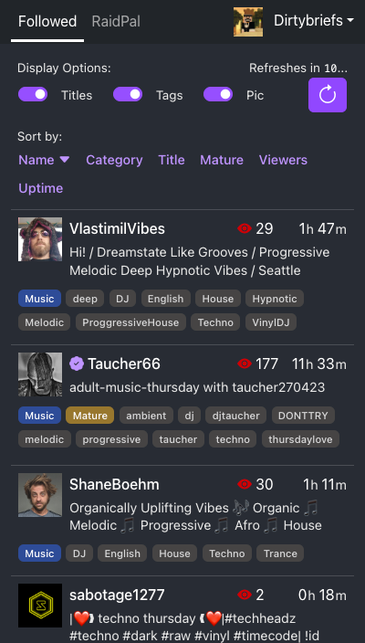
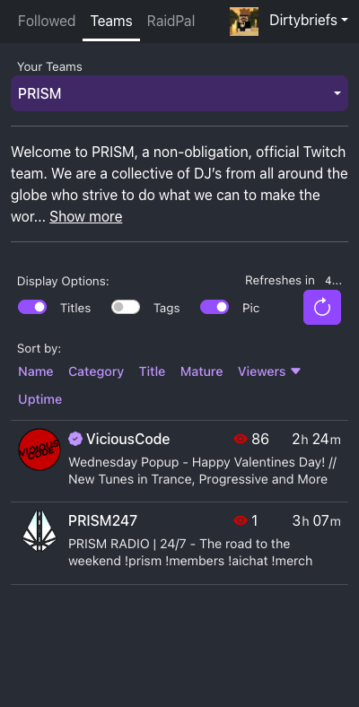
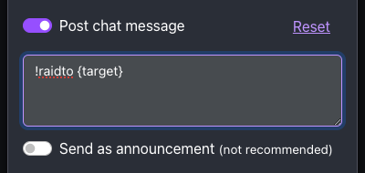

# Dirty Raid Target Finder

Twitch raid target finder. Usable as an OBS browser dock to make finding a raid target
quick and painless. Raid out right from the app, never typo someone's channel name again! 
Works great from a phone or tablet too! 

Features:
- **Client-side app** – Your personal data is never stored or transmitted anywhere but your own computer. Privacy™
- **OBS Dock** – Add this app as a custom browser dock to have a seamless stream experience.
- **No Typos** – Never worry about a channel name typo again, just click the big red button to raid!
- **Real Time** – The app refreshes automatically (every 15s) so you'll always have the latest status.
- **Sorting** – Sort your followed channels by name, viewer count, uptime and more!
- **[RaidPal integration](https://raidpal.com/)** – See how many raiders are arriving, check your raid target is online, uptime and more!
- **Twitch Teams integration** – See your live teammates from any of your teams.
- **Chat Announcements** – Post a chat message or announcement when you start a raid to let any stragglers know where you are going.
- **Raid Roulette** – Can't decide who to raid? No problem, pick one at random.


## Screenshots

By default, stream title, tags and profile pics are visible, but can be toggled for a more condensed list:

 

Can't decide? Select Raid Roulette at the bottom of the list to choose a random followed channel:


If you are a member of a Twitch Team, the Teams tab will be available with your live team members:



The [RaidPal](https://raidpal.com/) tab shows the events you have joined and the full lineup in your local timezone:
> You'll also be reminded you are not following fellow event channels. Support your event lineup!

 

Select a channel to see the stream info and push the big red button to start the raid!
> Enable the Post chat message option to customize and post a message in your chat for those that may miss the raid: 

 

> Use the placeholders `{Target}` for the channel's display name, and `{target}` for their regular name.

When `Post chat message` is enabled, the message will appear in your chat as a regular message from you.

 

By default, it will send as a message as you This enables you to use things like `/me`, use your sub emotes,
and even use an existing raid out command you might already have:

 

You may optionally enable the `Send as announcement` mode, which will post an announcement instead of a chat message.
> This is a legacy feature that is no longer recommended. Announcements, like Shoutouts, do not appear in channel history
> which makes for a poor experience for mobile viewers who are not actively in chat and get lost in the raid. When they
> return to chat, they may have no idea where the raid went to since the announcement is not persisted.

 


After starting the raid, you can cancel for up to 90 seconds, or until the raid is executed from the Twitch UX.


> Note: The Twitch API limits you to no more than 10 raids in a 10-minute window. Be decisive with your raids!

## Add to OBS


Add the app as a custom dock to OBS:
- From the menu, select `Docks` > `Custom Browser Docks...`
- Enter a name for the dock (e.g. `DirtyRaid`) and the url: `https://raid.dirtybriefs.net`
- Click `Apply` - the Dock should now appear, likely behind the Custom Browser Docks dialog.
- Move the dock to where ever you'd like, docking it to OBS or keep it detached for a separate monitor.

## Custom Events

Sometimes you may need to organize an event outside RaidPal for various reasons. With some effort, you can create a
RaidPal-compatible JSON file containing your event data. 

For example, see [exmaple-custom-event.json](docs%2Fexmaple-custom-event.json), used for the Velvet & Friends MERU 
fundraiser event.

You can drag and drop the JSON file into DirtyRaid and the Custom event tab will appear, containing the event lineup and 
stream status.

Alternatively, you can load a custom event by URL using the user dropdown menu. 

> Note: The server you are hosting the JSON from will need to support CORS, and set the CORS header appropriately. 

In the simplest form:

```json
{
  "event": {
    "title": "MERU Summer Fest 2024",
    "description": "Raising funds for MERU who adapt toys for children with disabilities",
    "slot_duration_mins": 120,
    "starttime": "2024-07-02T12:00:00Z",
    "inconsistent_slot_durations": true,
    "time_table": [
      {
        "order": 0,
        "starttime": "2024-07-25T09:00:00+01:00",
        "slot_occupied": true,
        "broadcaster_display_name": "Markinsutton",
        "broadcaster_id": null
      },
      {
        "order": 1,
        "starttime": "2024-07-25T11:00:00+01:00",
        "slot_occupied": true,
        "broadcaster_display_name": "Liquid_Bongo",
        "broadcaster_id": null
      },
      {
        "order": 2,
        "starttime": "2024-07-25T13:00:00+01:00",
        "slot_occupied": true,
        "user_timezone": "UTC",
        "broadcaster_display_name": "Mila_Pietrak",
        "broadcaster_id": null
      },
      {
        "order": 3,
        "starttime": "2024-07-25T17:00:00+01:00",
        "slot_occupied": true,
        "broadcaster_display_name": "JonGurd",
        "broadcaster_id": null
      },
      {
        "order": 4,
        "starttime": "2024-07-25T18:30:00+01:00",
        "slot_occupied": true,
        "broadcaster_display_name": "Markinsutton",
        "broadcaster_id": null
      }
    ]
  }
}
```

- Use `"inconsistent_slot_durations": true` to ignore the slot duration, and instead will use the start time of the next
 slot, when available.
- `slot_duration_mins` should be the default slot duration in minutes, but when `inconsistent_slot_durations` is enabled, it will only
  be used for the final slot duration
- `starttime` should be an ISO compatible timestamp. 
- `broadcaster_id` is not required. The display_name will be used instead with the Twitch APIs.
- For empty slots to be filled later, flag `"slot_occupied": false` and `"broadcaster_display_name": ""`


# Changelog

### v4.1.0 – 2024-07-25 – Custom events!
You can now load custom events using the RaidPal event format - Handy for events with arbitrary slot times that don't 
work within RaidPal, or events not organized using RaidPal.

See the [exmaple-custom-event.json](docs%2Fexmaple-custom-event.json) example for making your own custom event.

- Added ability to drag and drop a JSON event file into DirtyRaid, loading the custom event
- Added Custom Event modal, accessible from user dropdown
- Added Custom tab, visible when custom event is loaded. Works the same as RaidPal but does not currently offer nag for 
  following status

### v4.0.1 – 2024-06-18
- Fixed issue with RaidPal view showing incorrect end time when artist spans 3 or more adjacent slots

### v4.0.0 - 2024-02-14 - Real chat messages!
- Added toggle to optionally send as announcement (now defaults to chat message)
> Note: You will need to re-authenticate with Twitch in order to request the chat message permission scope

### v3.2.0 – 2023-09-26
- Added button to copy channel name in channel modal title (to clipboard)
- Fixed Teams section not fetching user data (resulted in missing profile images, disabled view channel button)
- Fixed long channel names pushing the close button off the modal on mobile devices

### v3.1.0 – 2023-06-29
- Fixed error message rendering issue when oauth tokens expire
- Updated error messages for consistent messaging

### v3.0.0 – 2023-04-28 – Teams, Roulette, & Announcements
The vast majority of this release comes from @Podders - Please give a big thanks for the contribution!
- Added new Teams page, to view your Twitch Teams and the live members
- Added optional chat announcement on raid, to inform viewers where to head if they get left behind
- Added Raid Roulette, for when you just can't decide who to raid
- Added RaidPal logo and link to RaidPal event page
- Added viewer count to live badge on RaidPal lineup
- Added countdown timer to the Cancel Raid button to get a better idea when the Raid will actually fire
- Various UI tweaks and enhancements

> Note: You will need to re-authenticate with Twitch in order to request the announcement permission scope

### v2.0.2 - 2023-04-17
- Fixed a crash that could occur if the user has no joined events or has not joined RaidPal.

### v2.0.1 - 2023-04-13
- Changed channel offline message

### v2.0.0 - 2023-04-13 – RaidPal Integration
- Added RaidPal tab with the user's event list and lineup, as well as the live status of event channels
- Added follow status badge to event lineup, so you can see who you forgot to follow
- Added AM/PM-Hundred Hour toggle for RaidPal lineup slot times

### v1.4.0 - 2023-04-06
- Added button to view channel on channel detail modal

### v1.3.0 - 2023-04-06
- Added refresh feedback so automatic refresh is more transparent
- Logged-in user profile image displayed instead of Twitch logo
- Added handling for long channel names

### v1.2.0 - 2023-04-06
- Added channel profile pics and information
- Display preferences are persisted
- Partner badges are displayed where applicable
- Added profile pic placeholder when images are not available

### v1.1.0 – 2023-04-04
- Updated app OBS / documentation link url

### v1.0.0 – 2023-04-04
- Initial release

# Contributing

Have some ideas, feedback, or want to add some features? Hit me up on Discord, open an issue, or fire a PR this way!

# Contributors
- [Dirtybriefs](https://twitch.tv/dirtybriefs) 
- [PoddersDJ](https://twitch.tv/poddersdj)
- [VlastimilVibes](https://twitch.tv/vlastimilvibes)

# Attributions

Roulette image © Ralf Roletschek, Ralf Roletschek creator QS:P170,Q15080600, 13-02-27-spielbank-wiesbaden-by-RalfR-094, cropping by DirtyRaid, CC BY-SA 3.0

# Toolchain

This project was bootstrapped with [Create React App](https://github.com/facebook/create-react-app).

## Available Scripts

In the project directory, you can run:

### `npm start`

Runs the app in the development mode.\
Open [http://localhost:3000](http://localhost:3000) to view it in your browser.

The page will reload when you make changes.\
You may also see any lint errors in the console.

### `npm test`

Launches the test runner in the interactive watch mode.\
See the section about [running tests](https://facebook.github.io/create-react-app/docs/running-tests) for more information.

### `npm run build`

Builds the app for production to the `build` folder.\
It correctly bundles React in production mode and optimizes the build for the best performance.

The build is minified and the filenames include the hashes.\
Your app is ready to be deployed!

See the section about [deployment](https://facebook.github.io/create-react-app/docs/deployment) for more information.

### `npm run eject`

**Note: this is a one-way operation. Once you `eject`, you can't go back!**

If you aren't satisfied with the build tool and configuration choices, you can `eject` at any time. This command will remove the single build dependency from your project.

Instead, it will copy all the configuration files and the transitive dependencies (webpack, Babel, ESLint, etc) right into your project so you have full control over them. All of the commands except `eject` will still work, but they will point to the copied scripts so you can tweak them. At this point you're on your own.

You don't have to ever use `eject`. The curated feature set is suitable for small and middle deployments, and you shouldn't feel obligated to use this feature. However we understand that this tool wouldn't be useful if you couldn't customize it when you are ready for it.

## Learn More

You can learn more in the [Create React App documentation](https://facebook.github.io/create-react-app/docs/getting-started).

To learn React, check out the [React documentation](https://reactjs.org/).

### Code Splitting

This section has moved here: [https://facebook.github.io/create-react-app/docs/code-splitting](https://facebook.github.io/create-react-app/docs/code-splitting)

### Analyzing the Bundle Size

This section has moved here: [https://facebook.github.io/create-react-app/docs/analyzing-the-bundle-size](https://facebook.github.io/create-react-app/docs/analyzing-the-bundle-size)

### Making a Progressive Web App

This section has moved here: [https://facebook.github.io/create-react-app/docs/making-a-progressive-web-app](https://facebook.github.io/create-react-app/docs/making-a-progressive-web-app)

### Advanced Configuration

This section has moved here: [https://facebook.github.io/create-react-app/docs/advanced-configuration](https://facebook.github.io/create-react-app/docs/advanced-configuration)

### Deployment

This section has moved here: [https://facebook.github.io/create-react-app/docs/deployment](https://facebook.github.io/create-react-app/docs/deployment)

### `npm run build` fails to minify

This section has moved here: [https://facebook.github.io/create-react-app/docs/troubleshooting#npm-run-build-fails-to-minify](https://facebook.github.io/create-react-app/docs/troubleshooting#npm-run-build-fails-to-minify)
